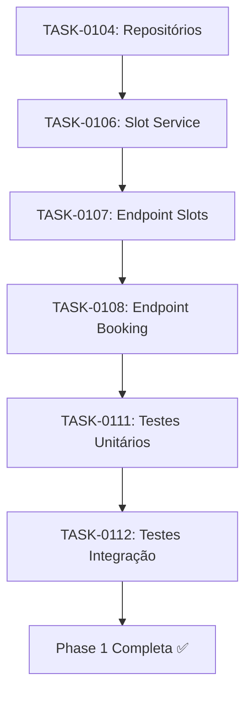

# Phase 1 - Análise de Status e Próximos Passos

**Data**: 2025-10-16  
**Referência**: `plan/feature-platform-implementation-1.md`

---

## 📊 Status Atual Phase 1

### ✅ Completado (7/13 tasks - 54%)

| Task | Descrição | Status | Arquivos | Notas |
|------|-----------|--------|----------|-------|
| **TASK-0100** | Model User + Argon2 | ✅ 100% | `db/models/user.py`<br>`core/security/password.py` | Hash Argon2id configurado |
| **TASK-0101** | JWT utils + refresh | ✅ 100% | `core/security/jwt.py` | Rotation implementado |
| **TASK-0102** | Endpoints auth | ✅ 100% | `api/v1/routes/auth.py`<br>`api/v1/schemas/auth.py` | 4 endpoints: register, login, refresh, me |
| **TASK-0103** | Models entidades | ✅ 100% | `db/models/salon.py`<br>`db/models/professional.py`<br>`db/models/service.py`<br>`db/models/availability.py`<br>`db/models/booking.py` | 5 modelos + relacionamentos |
| **TASK-0105** | Migração Alembic | ✅ 100% | `alembic/versions/891c705f503c_*.py` | 7 tabelas criadas |
| **TASK-0109** | RBAC decorator | ✅ 100% | `core/security/rbac.py` | 6 helpers + endpoint /me |
| **TASK-0110** | OpenAPI docs | 🔄 50% | Swagger em `/docs` | Apenas Auth documentado |

### 🔄 Em Progresso (1/13 tasks - 8%)

| Task | Descrição | Status | Faltando |
|------|-----------|--------|----------|
| **TASK-0104** | Repositórios | 🔄 15% | Apenas `user.py` existe.<br>Faltam: salon, professional, service, availability, booking |

### ⏳ Pendente (5/13 tasks - 38%)

| Task | Descrição | Prioridade | Estimativa | Dependências |
|------|-----------|------------|------------|--------------|
| **TASK-0106** | Slot calculation service | 🔴 Alta | 4-6h | TASK-0104 (repos) |
| **TASK-0107** | Endpoint buscar slots | 🔴 Alta | 2-3h | TASK-0106 |
| **TASK-0108** | Endpoint criar reserva | 🔴 Alta | 3-4h | TASK-0104, TASK-0107 |
| **TASK-0111** | Testes unitários | 🟡 Média | 4-5h | TASK-0106 |
| **TASK-0112** | Testes integração | 🟡 Média | 5-6h | TASK-0108 |

---

## 🎯 Plano de Ação para Finalizar Phase 1

### Estratégia Recomendada

**Ordem de Execução** (baseada em dependências):



### 1️⃣ **TASK-0104: Completar Repositórios** (Próxima)

**Objetivo**: Criar repositories para todas as entidades

**Arquivos a criar**:
- `backend/app/db/repositories/salon.py`
- `backend/app/db/repositories/professional.py`
- `backend/app/db/repositories/service.py`
- `backend/app/db/repositories/availability.py`
- `backend/app/db/repositories/booking.py`

**Template de Repository** (seguir padrão do `user.py`):
```python
class SalonRepository:
    def __init__(self, db: AsyncSession):
        self.db = db
    
    async def create(...) -> Salon: ...
    async def get_by_id(id: int) -> Salon | None: ...
    async def list(...) -> list[Salon]: ...
    async def update(...) -> Salon: ...
    async def delete(id: int) -> bool: ...
    # Métodos específicos do domínio
```

**Critérios de Conclusão**:
- [ ] 5 repositories criados
- [ ] Métodos CRUD básicos em cada um
- [ ] Type hints completos
- [ ] Docstrings em todas as funções

**Estimativa**: 3-4 horas

---

### 2️⃣ **TASK-0106: Slot Calculation Service**

**Objetivo**: Implementar lógica de cálculo de horários disponíveis

**Arquivo**: `backend/app/domain/scheduling/services/slot_service.py`

**Funcionalidades Principais**:

1. **`calculate_available_slots()`**
   - Input: professional_id, date, service_duration
   - Buscar availability do profissional para a data
   - Buscar bookings existentes
   - Calcular gaps livres
   - Retornar lista de slots disponíveis

2. **`check_slot_conflict()`**
   - Verificar se um slot está disponível
   - Considerar bookings existentes
   - Considerar horário de funcionamento

3. **Regras de Negócio**:
   - Respeitar horário de funcionamento do salão
   - Considerar bloqueios do profissional
   - Não permitir overlap de reservas
   - Buffer entre serviços (configurável)

**Estrutura**:
```python
from datetime import date, time, datetime, timedelta
from backend.app.db.models.availability import Availability
from backend.app.db.models.booking import Booking, BookingStatus

class SlotService:
    def __init__(self, db: AsyncSession):
        self.db = db
    
    async def calculate_available_slots(
        self,
        professional_id: int,
        date: date,
        service_duration: int,  # minutes
        buffer_minutes: int = 0
    ) -> list[dict]:
        """
        Calculate available time slots for a professional.
        
        Returns:
            List of dicts with {start_time, end_time, duration}
        """
        # 1. Get professional availability for date
        # 2. Get existing bookings
        # 3. Calculate free gaps
        # 4. Generate slots of service_duration
        ...
```

**Critérios de Conclusão**:
- [ ] Função principal implementada
- [ ] Lógica de gaps funcionando
- [ ] Respeita availability + bookings
- [ ] Docstrings completas

**Estimativa**: 4-6 horas

---

### 3️⃣ **TASK-0107: Endpoint Buscar Slots**

**Objetivo**: Endpoint REST para buscar horários disponíveis

**Arquivo**: `backend/app/api/v1/routes/scheduling.py` (novo)

**Endpoint**: `GET /v1/scheduling/slots`

**Query Parameters**:
- `professional_id` (required)
- `date` (required, format: YYYY-MM-DD)
- `service_id` (required, para pegar duration)

**Response**:
```json
{
  "professional_id": 1,
  "date": "2025-10-17",
  "service_duration": 60,
  "available_slots": [
    {"start_time": "09:00", "end_time": "10:00"},
    {"start_time": "10:00", "end_time": "11:00"},
    {"start_time": "14:00", "end_time": "15:00"}
  ]
}
```

**Critérios de Conclusão**:
- [ ] Endpoint criado e registrado no router
- [ ] Schema Pydantic para request/response
- [ ] Validações de input
- [ ] RBAC: qualquer usuário autenticado
- [ ] Documentação OpenAPI

**Estimativa**: 2-3 horas

---

### 4️⃣ **TASK-0108: Endpoint Criar Reserva**

**Objetivo**: Endpoint REST para criar reservas (bookings)

**Arquivo**: `backend/app/api/v1/routes/bookings.py` (novo)

**Endpoints**:

1. **POST /v1/bookings** - Criar reserva
   - RBAC: CLIENT
   - Input: service_id, professional_id, scheduled_at, notes
   - Validar slot disponível
   - Criar booking com status PENDING
   - Retornar booking criado

2. **GET /v1/bookings** - Listar reservas
   - RBAC: Todos autenticados
   - Filtros por role:
     - CLIENT: apenas próprias reservas
     - PROFESSIONAL: reservas atribuídas a ele
     - SALON_OWNER: reservas do salão
     - ADMIN: todas

3. **GET /v1/bookings/{id}** - Detalhes
   - RBAC: Validar acesso conforme role

4. **PATCH /v1/bookings/{id}/status** - Atualizar status
   - RBAC: PROFESSIONAL ou STAFF
   - Transições válidas: PENDING → CONFIRMED → IN_PROGRESS → COMPLETED

5. **DELETE /v1/bookings/{id}** - Cancelar
   - RBAC: CLIENT (próprias) ou STAFF
   - Marcar como CANCELLED

**Schemas Pydantic**:
```python
class BookingCreateRequest(BaseModel):
    service_id: int
    professional_id: int
    scheduled_at: datetime
    notes: str | None = None

class BookingResponse(BaseModel):
    id: int
    client_id: int
    professional_id: int
    service_id: int
    scheduled_at: datetime
    duration_minutes: int
    status: BookingStatus
    service_price: Decimal
    notes: str | None
    created_at: datetime
    updated_at: datetime
```

**Regras de Negócio**:
- Verificar slot disponível antes de criar
- Snapshot do preço do serviço
- Cliente só pode ter 1 reserva PENDING por vez (configurável)

**Critérios de Conclusão**:
- [ ] 5 endpoints implementados
- [ ] RBAC aplicado corretamente
- [ ] Validações de negócio
- [ ] Schemas completos
- [ ] Documentação OpenAPI

**Estimativa**: 3-4 horas

---

### 5️⃣ **TASK-0111: Testes Unitários**

**Objetivo**: Testar funções isoladas (sem DB)

**Arquivos**: `tests/unit/`

**Cobertura Mínima**:

1. **`tests/unit/test_password.py`**
   - Hashing Argon2
   - Verify password
   - Needs rehash

2. **`tests/unit/test_jwt.py`**
   - Token generation
   - Token verification
   - Token expiration
   - Invalid tokens

3. **`tests/unit/test_slot_service.py`**
   - Calculate gaps
   - Handle overlaps
   - Edge cases (início/fim do dia)
   - Buffer entre slots

4. **`tests/unit/test_rbac.py`**
   - Role validations
   - Permission checks

**Critérios de Conclusão**:
- [ ] ≥80% coverage das funções testadas
- [ ] Testes passando
- [ ] Fixtures organizados

**Estimativa**: 4-5 horas

---

### 6️⃣ **TASK-0112: Testes de Integração**

**Objetivo**: Testar fluxos completos end-to-end

**Arquivos**: `tests/integration/`

**Cenários**:

1. **`test_auth_flow.py`**
   - Register → Login → Access protected endpoint → Refresh token

2. **`test_booking_flow.py`**
   - Create salon → Create professional → Create service
   - Set availability → Search slots → Create booking
   - Update booking status → Cancel booking

3. **`test_rbac_permissions.py`**
   - Test each role's access to endpoints
   - Verify denial of unauthorized access

**Setup**:
- Database de teste (fixture)
- Seed data inicial
- Cleanup após cada teste

**Critérios de Conclusão**:
- [ ] 3+ cenários cobertos
- [ ] Testes passando
- [ ] Fixtures reutilizáveis

**Estimativa**: 5-6 horas

---

## 📈 Métricas de Conclusão Phase 1

### Checklist Final

- [ ] **Modelos**: 6 modelos SQLAlchemy com relacionamentos ✅
- [ ] **Migração**: Alembic migration aplicada ✅
- [ ] **Repositories**: 5 repositories CRUD completos
- [ ] **Autenticação**: JWT + Argon2 + RBAC ✅
- [ ] **Endpoints Auth**: Register, Login, Refresh, Me ✅
- [ ] **Endpoints Scheduling**: Buscar slots
- [ ] **Endpoints Bookings**: CRUD completo de reservas
- [ ] **Domain Service**: SlotService com lógica de cálculo
- [ ] **Testes Unitários**: ≥80% coverage funções críticas
- [ ] **Testes Integração**: ≥3 cenários end-to-end
- [ ] **Documentação**: OpenAPI completa
- [ ] **Docker**: Todos os serviços rodando ✅

### Issues GitHub Associadas

**Podem ser fechadas após Phase 1**:
- ✅ GH-001: Cadastro cliente
- ✅ GH-002: Login autenticação
- ✅ GH-024: Gestão usuários/permissões (RBAC)
- ✅ GH-026: Rate limiting
- ✅ GH-041: Autenticação JWT
- ⏳ GH-004: Cadastro salão (modelo OK, faltam endpoints)
- ⏳ GH-005: Cadastro profissional (modelo OK, faltam endpoints)
- ⏳ GH-006: Catálogo serviços (modelo OK, faltam endpoints)
- ⏳ GH-007: Disponibilidade (modelo OK, faltam endpoints)
- ⏳ GH-008: Buscar slots (aguardando TASK-0106/0107)
- ⏳ GH-009: Reservar serviço (aguardando TASK-0108)

---

## ⏱️ Timeline Estimado

| Task | Estimativa | Dependências |
|------|------------|--------------|
| TASK-0104 (Repositories) | 3-4h | Nenhuma ✅ |
| TASK-0106 (Slot Service) | 4-6h | TASK-0104 |
| TASK-0107 (Endpoint Slots) | 2-3h | TASK-0106 |
| TASK-0108 (Endpoint Booking) | 3-4h | TASK-0104, TASK-0107 |
| TASK-0111 (Unit Tests) | 4-5h | TASK-0106 |
| TASK-0112 (Integration Tests) | 5-6h | TASK-0108 |
| **Total** | **21-28h** | |

**ETA para Phase 1 completa**: 3-4 dias úteis

---

## 🚀 Próxima Ação Imediata

### TASK-0104: Criar Repositories

**Start now**: Criar os 5 repositories faltantes seguindo o padrão do `UserRepository`.

**Ordem sugerida**:
1. `SalonRepository` (base, sem dependências)
2. `ProfessionalRepository` (depende de Salon + User)
3. `ServiceRepository` (depende de Salon)
4. `AvailabilityRepository` (depende de Professional)
5. `BookingRepository` (depende de User + Professional + Service)

**Template para começar**:
```python
# backend/app/db/repositories/salon.py
from sqlalchemy import select
from sqlalchemy.ext.asyncio import AsyncSession
from backend.app.db.models.salon import Salon

class SalonRepository:
    def __init__(self, db: AsyncSession):
        self.db = db
    
    async def create(self, **kwargs) -> Salon:
        salon = Salon(**kwargs)
        self.db.add(salon)
        await self.db.commit()
        await self.db.refresh(salon)
        return salon
    
    async def get_by_id(self, salon_id: int) -> Salon | None:
        result = await self.db.execute(
            select(Salon).where(Salon.id == salon_id)
        )
        return result.scalar_one_or_none()
    
    # ... mais métodos
```

---

**Última Atualização**: 2025-10-16 18:10 UTC  
**Progresso**: 54% (7/13) → **Target**: 100% (13/13)  
**Próxima Task**: TASK-0104 - Repositories 🚀
