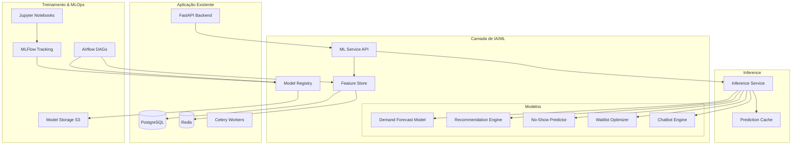

# 🤖 Plano de Implementação de Inteligência Artificial - eSalão App

**Data:** 21 de outubro de 2025  
**Versão:** 1.0  
**Status:** 📋 PLANEJAMENTO

---

## 📊 Análise do Projeto Atual

Baseado na análise do código, o eSalão App possui:
- ✅ Sistema de reservas (bookings) completo
- ✅ Gestão de profissionais, serviços e salões
- ✅ Sistema de notificações multi-canal
- ✅ Fila de espera (waitlist) automatizada
- ✅ Política de cancelamento e no-show
- ✅ Sistema de fidelidade (loyalty points)
- ✅ Relatórios e analytics avançados
- ✅ Pagamentos integrados
- ✅ Infraestrutura robusta (PostgreSQL, Redis, Celery)

---

## 🎯 Oportunidades de IA Identificadas

### **1. IA para Previsão de Demanda e Otimização de Agenda** ⭐⭐⭐
**Impacto:** ALTO | **Complexidade:** MÉDIA

**Objetivo:** Prever demanda futura e otimizar alocação de profissionais

**Capacidades:**
- Previsão de ocupação por horário/dia/semana
- Identificação de padrões sazonais
- Sugestão de melhor horário para abrir agenda
- Alertas de sobrecarga ou ociosidade

**Dados Disponíveis:**
- Histórico de bookings (`bookings` table)
- Padrões de cancelamento
- Sazonalidade (datas especiais)
- Histórico de waitlist

**Tecnologias Sugeridas:**
- **Prophet** (Facebook) - Previsão de séries temporais
- **Scikit-learn** - Regressão e classificação
- **XGBoost** - Modelos ensemble

**Entregáveis:**
```python
# Endpoint de previsão
GET /api/v1/ai/demand-forecast?professional_id=1&date_range=7days
Response: {
    "forecast": [
        {"date": "2025-10-22", "predicted_bookings": 8, "confidence": 0.85},
        {"date": "2025-10-23", "predicted_bookings": 12, "confidence": 0.90}
    ],
    "recommendations": [
        "Aumentar disponibilidade na terça-feira (alta demanda prevista)",
        "Considerar promoção para quinta-feira (baixa demanda)"
    ]
}
```

---

### **2. IA para Recomendação Personalizada de Serviços** ⭐⭐⭐
**Impacto:** ALTO | **Complexidade:** MÉDIA

**Objetivo:** Recomendar serviços, profissionais e horários personalizados

**Capacidades:**
- Recomendação de serviços baseada em histórico
- Match cliente-profissional (preferências + disponibilidade)
- Sugestão de upsell/cross-sell inteligente
- Personalização de ofertas de fidelidade

**Dados Disponíveis:**
- Histórico de bookings por cliente
- Preferências de profissionais
- Padrões de horário preferido
- Pontos de fidelidade e resgates

**Tecnologias Sugeridas:**
- **Collaborative Filtering** - Recomendação baseada em similaridade
- **Content-Based Filtering** - Características dos serviços
- **Hybrid Models** - Combinação de abordagens
- **Embeddings** - Representação vetorial de clientes/serviços

**Entregáveis:**
```python
# Endpoint de recomendação
GET /api/v1/ai/recommendations?user_id=1
Response: {
    "next_booking_suggestions": [
        {
            "service_id": 5,
            "service_name": "Coloração + Hidratação",
            "confidence": 0.92,
            "reason": "Você costuma fazer coloração a cada 6 semanas. Próxima sugestão: 25/10",
            "estimated_price": 180.00,
            "recommended_professional_id": 3
        }
    ],
    "personalized_offers": [
        {
            "service_id": 12,
            "discount_percent": 15,
            "reason": "Experimente nosso novo tratamento! 15% off para clientes fiéis"
        }
    ]
}
```

---

### **3. IA para Otimização de Fila de Espera** ⭐⭐⭐
**Impacto:** MÉDIO-ALTO | **Complexidade:** MÉDIA

**Objetivo:** Maximizar taxa de conversão da waitlist com IA

**Capacidades:**
- Priorização inteligente da fila (probabilidade de aceitar)
- Previsão de taxa de conversão por cliente
- Otimização de tempo de oferta (melhor momento para notificar)
- Sugestão de slots alternativos

**Dados Disponíveis:**
- Histórico de waitlist (`waitlist` table)
- Taxa de aceitação/rejeição por cliente
- Tempo de resposta histórico
- Preferências de horário

**Tecnologias Sugeridas:**
- **Gradient Boosting** (XGBoost/LightGBM) - Classificação
- **Reinforcement Learning** - Otimização de decisões sequenciais

**Entregáveis:**
```python
# Service de priorização inteligente
class AIWaitlistOptimizer:
    async def prioritize_waitlist(
        self, 
        available_slot: datetime,
        waitlist_entries: List[Waitlist]
    ) -> List[WaitlistScore]:
        """
        Retorna waitlist ordenada por probabilidade de conversão.
        
        Considera:
        - Taxa histórica de aceitação do cliente
        - Horário preferido vs slot disponível
        - Tempo na fila
        - Nível de fidelidade
        """
        pass
```

---

### **4. IA para Previsão de No-Shows** ⭐⭐
**Impacto:** MÉDIO | **Complexidade:** BAIXA-MÉDIA

**Objetivo:** Prever probabilidade de no-show e tomar ações preventivas

**Capacidades:**
- Score de risco de no-show por booking
- Alertas preventivos (SMS/email extra para clientes de risco)
- Sugestão de overbooking inteligente
- Identificação de padrões de no-show

**Dados Disponíveis:**
- Histórico de no-shows por cliente
- Padrões de cancelamento
- Tempo de antecedência do booking
- Histórico de pagamentos/depósitos

**Tecnologias Sugeridas:**
- **Logistic Regression** - Classificação binária simples
- **Random Forest** - Interpretabilidade
- **Neural Networks** - Precisão avançada

**Entregáveis:**
```python
# Endpoint de previsão
GET /api/v1/ai/no-show-risk?booking_id=123
Response: {
    "booking_id": 123,
    "no_show_probability": 0.35,
    "risk_level": "MEDIUM",
    "risk_factors": [
        "Cliente tem 2 no-shows nos últimos 3 meses",
        "Reserva feita com menos de 24h de antecedência",
        "Horário de baixa adesão histórica (18h)"
    ],
    "recommended_actions": [
        "Enviar confirmação extra 2h antes",
        "Solicitar depósito de 30%",
        "Colocar na lista de overbooking (10%)"
    ]
}
```

---

### **5. Chatbot IA para Atendimento e Agendamento** ⭐⭐
**Impacto:** ALTO | **Complexidade:** ALTA

**Objetivo:** Assistente virtual para agendamento e dúvidas

**Capacidades:**
- Agendamento conversacional via WhatsApp/Chat
- Respostas a perguntas frequentes
- Sugestões de serviços e horários
- Remarcação/cancelamento assistido

**Tecnologias Sugeridas:**
- **OpenAI GPT-4** - Conversação avançada
- **Anthropic Claude** - Alternativa robusta
- **Rasa** - Chatbot open-source customizável
- **Langchain** - Orquestração de LLMs

**Entregáveis:**
```python
# Exemplo de integração
POST /api/v1/ai/chatbot
Request: {
    "user_id": 1,
    "message": "Quero marcar corte de cabelo para semana que vem"
}
Response: {
    "reply": "Claro! Temos disponibilidade na semana que vem. Qual dia prefere? Terça, Quarta ou Quinta?",
    "suggested_actions": [
        {"type": "quick_reply", "text": "Terça-feira", "value": "2025-10-22"},
        {"type": "quick_reply", "text": "Quarta-feira", "value": "2025-10-23"},
        {"type": "quick_reply", "text": "Quinta-feira", "value": "2025-10-24"}
    ],
    "intent": "book_appointment",
    "confidence": 0.95
}
```

---

### **6. IA para Precificação Dinâmica** ⭐
**Impacto:** MÉDIO | **Complexidade:** ALTA

**Objetivo:** Otimizar preços baseado em demanda e ocupação

**Capacidades:**
- Preços dinâmicos por horário (surge pricing)
- Descontos inteligentes para horários vazios
- Promoções personalizadas baseadas em comportamento
- Otimização de receita

**Tecnologias Sugeridas:**
- **Reinforcement Learning** - Otimização de precificação
- **Bayesian Optimization** - Experimentação de preços
- **A/B Testing** integrado

---

### **7. IA para Análise de Sentimento e Feedback** ⭐
**Impacto:** BAIXO-MÉDIO | **Complexidade:** BAIXA

**Objetivo:** Análise automática de reviews e feedback

**Capacidades:**
- Classificação de sentimento (positivo/negativo/neutro)
- Extração de tópicos principais
- Alertas de feedback negativo
- Dashboard de satisfação por profissional/salão

**Tecnologias Sugeridas:**
- **HuggingFace Transformers** - Modelos pré-treinados
- **BERT** para português - Análise de sentimento
- **Topic Modeling** (LDA) - Extração de tópicos

---

## 🏗️ Arquitetura Proposta



---

## 📋 Roadmap de Implementação

### **FASE 1: Fundação (4-6 semanas)**
**Objetivo:** Setup de infraestrutura ML e primeiro modelo em produção

✅ **Sprint 1-2: Setup de Infraestrutura**
- [ ] Configurar ML Service (FastAPI separado)
- [ ] Setup MLFlow para tracking
- [ ] Feature Store básico (extrair features do PostgreSQL)
- [ ] Pipeline de dados para treinamento

✅ **Sprint 3-4: Primeiro Modelo - Previsão de No-Show**
- [ ] Análise exploratória de dados (EDA)
- [ ] Feature engineering (histórico de no-shows, tempo de booking, etc)
- [ ] Treinamento de modelo (Random Forest baseline)
- [ ] Endpoint de inference `/ai/no-show-risk`
- [ ] Integração com sistema de notificações

**Entregas:**
- [ ] ML Service rodando em produção
- [ ] Modelo de No-Show com >75% accuracy
- [ ] Endpoint integrado ao booking flow
- [ ] Dashboard MLFlow com métricas

---

### **FASE 2: Expansão (6-8 semanas)**
**Objetivo:** Recomendação e otimização de demanda

✅ **Sprint 5-6: Sistema de Recomendação**
- [ ] Feature engineering (histórico de serviços, preferências)
- [ ] Collaborative filtering baseline
- [ ] Hybrid model (content + collaborative)
- [ ] Endpoint `/ai/recommendations`
- [ ] A/B testing framework

✅ **Sprint 7-8: Previsão de Demanda**
- [ ] Séries temporais (Prophet)
- [ ] Features: sazonalidade, feriados, eventos
- [ ] Endpoint `/ai/demand-forecast`
- [ ] Dashboard para salon owners

**Entregas:**
- [ ] Sistema de recomendação com >10% lift em conversão
- [ ] Previsão de demanda com MAPE <20%
- [ ] Dashboards de IA para gestores

---

### **FASE 3: Inteligência Avançada (8-10 semanas)**
**Objetivo:** Otimização de waitlist e chatbot

✅ **Sprint 9-10: Otimização de Waitlist**
- [ ] Modelo de conversão de waitlist
- [ ] Priorização inteligente
- [ ] Integração com notificações automáticas

✅ **Sprint 11-12: Chatbot Básico**
- [ ] Setup Rasa ou integração OpenAI
- [ ] Intents: agendamento, cancelamento, dúvidas
- [ ] Integração WhatsApp Business API
- [ ] Fallback para atendimento humano

**Entregas:**
- [ ] Waitlist com >30% aumento em conversão
- [ ] Chatbot atendendo >50% das consultas automaticamente

---

### **FASE 4: Otimização e Escalabilidade (contínua)**

✅ **Melhorias Contínuas**
- [ ] A/B testing de modelos
- [ ] Re-treinamento automático (Airflow DAGs)
- [ ] Monitoring de drift de modelo
- [ ] Análise de sentimento de reviews
- [ ] Precificação dinâmica (experimental)

---

## 🛠️ Stack Tecnológica Recomendada

### **Core ML**
```python
# requirements-ml.txt
scikit-learn==1.3.2        # ML básico
xgboost==2.0.3             # Gradient boosting
lightgbm==4.1.0            # Gradient boosting alternativo
prophet==1.1.5             # Séries temporais
pandas==2.1.4              # Data manipulation
numpy==1.26.2              # Computação numérica
```

### **Deep Learning (opcional)**
```python
torch==2.1.2               # PyTorch
transformers==4.36.2       # HuggingFace
sentence-transformers==2.2.2  # Embeddings
```

### **MLOps**
```python
mlflow==2.9.2              # Tracking & registry
optuna==3.5.0              # Hyperparameter tuning
feast==0.35.0              # Feature store
evidently==0.4.13          # Model monitoring
```

### **Chatbot**
```python
rasa==3.6.13               # Open-source chatbot
openai==1.6.1              # GPT-4 integration
langchain==0.1.0           # LLM orchestration
```

### **Infraestrutura**
```yaml
# docker-compose-ml.yml
services:
  ml-service:
    image: esalao/ml-service:latest
    ports:
      - "8001:8000"
    environment:
      - DATABASE_URL=${DATABASE_URL}
      - REDIS_URL=${REDIS_URL}
      - MLFLOW_TRACKING_URI=http://mlflow:5000
    depends_on:
      - mlflow
      - postgres
      - redis
  
  mlflow:
    image: ghcr.io/mlflow/mlflow:v2.9.2
    ports:
      - "5000:5000"
    command: mlflow server --host 0.0.0.0 --backend-store-uri postgresql://...
  
  jupyter:
    image: jupyter/scipy-notebook:latest
    ports:
      - "8888:8888"
    volumes:
      - ./notebooks:/home/jovyan/work
```

---

## 📊 Estrutura de Arquivos Proposta

```
esalao_app/
├── backend/
│   └── app/
│       └── (código existente)
│
├── ml_service/                    # Novo serviço ML
│   ├── app/
│   │   ├── __init__.py
│   │   ├── main.py               # FastAPI ML service
│   │   ├── api/
│   │   │   ├── v1/
│   │   │   │   ├── routes/
│   │   │   │   │   ├── predictions.py
│   │   │   │   │   ├── recommendations.py
│   │   │   │   │   └── chatbot.py
│   │   │   │   └── schemas/
│   │   │   │       └── ml_schemas.py
│   │   ├── models/               # Código dos modelos
│   │   │   ├── no_show_predictor.py
│   │   │   ├── demand_forecaster.py
│   │   │   ├── recommendation_engine.py
│   │   │   └── waitlist_optimizer.py
│   │   ├── features/             # Feature engineering
│   │   │   ├── extractors.py
│   │   │   └── transformers.py
│   │   ├── training/             # Scripts de treinamento
│   │   │   ├── train_no_show.py
│   │   │   └── train_demand.py
│   │   └── utils/
│   │       ├── model_loader.py
│   │       └── cache.py
│   ├── tests/
│   ├── models/                   # Modelos treinados (.pkl)
│   │   └── .gitkeep
│   ├── Dockerfile
│   ├── requirements-ml.txt
│   └── pyproject.toml
│
├── notebooks/                     # Jupyter notebooks
│   ├── 01_exploratory_analysis.ipynb
│   ├── 02_no_show_model.ipynb
│   ├── 03_recommendation_model.ipynb
│   └── 04_demand_forecast.ipynb
│
├── airflow/                       # DAGs de treinamento
│   └── dags/
│       ├── retrain_no_show_model.py
│       └── update_features.py
│
└── plan/
    └── AI_IMPLEMENTATION_PLAN.md  # Este documento
```

---

## 💰 Estimativa de Custos

### **Desenvolvimento (Fase 1-3)**
- **Equipe:** 1 ML Engineer + 1 Data Scientist (6 meses)
- **Infraestrutura:** 
  - AWS EC2 (ml.m5.xlarge): ~$150/mês
  - AWS S3 (modelos): ~$20/mês
  - MLFlow + Airflow (ECS): ~$100/mês
  - Redis extra (caching): ~$30/mês
- **APIs Externas:**
  - OpenAI API (chatbot): ~$200/mês (inicial)

**Total estimado:** $300-500/mês infra + time de desenvolvimento

### **ROI Esperado**
- ↑ **15-25%** em conversão de bookings (recomendação)
- ↓ **30-40%** em taxa de no-shows (prevenção)
- ↑ **20-30%** em taxa de aceitação de waitlist (otimização)
- ↓ **50%** em tempo de atendimento (chatbot)

---

## 🎯 KPIs de Sucesso

### **Métricas de Modelo**
- **No-Show Predictor:** Precision >75%, Recall >70%
- **Recommendation Engine:** CTR >10%, Conversion lift >15%
- **Demand Forecast:** MAPE <20%, MAE <2 bookings/dia
- **Waitlist Optimizer:** Conversion rate >+30%

### **Métricas de Negócio**
- Aumento de receita por cliente (LTV)
- Redução de slots vazios
- Aumento de satisfação (NPS)
- Redução de custos operacionais

---

## 🚨 Riscos e Mitigações

| Risco | Probabilidade | Impacto | Mitigação |
|-------|--------------|---------|-----------|
| Dados insuficientes para treinar | MÉDIA | ALTO | Iniciar com modelos simples, coletar mais dados, usar transfer learning |
| Modelos com baixa acurácia | MÉDIA | MÉDIO | Baseline rigoroso, A/B testing, fallback para regras manuais |
| Custo de APIs (GPT-4) elevado | BAIXA | MÉDIO | Usar modelos open-source (Rasa), rate limiting, cache agressivo |
| Drift de modelo em produção | ALTA | MÉDIO | Monitoring contínuo (Evidently), re-treinamento automático |
| Resistência dos usuários | BAIXA | BAIXO | Introdução gradual, opt-in inicial, educação |

---

## 🔄 Próximos Passos Imediatos

### **AGORA (Esta semana)**
1. ✅ Aprovação do plano de IA
2. ⏳ Definir prioridade de features (votação stakeholders)
3. ⏳ Setup de ambiente de ML (Docker, MLFlow)

### **PRÓXIMA SPRINT (2 semanas)**
4. ⏳ Análise exploratória de dados (EDA) - No-Show
5. ⏳ Implementar Feature Store básico
6. ⏳ Treinar primeiro modelo (No-Show Predictor)
7. ⏳ Criar endpoint `/ai/no-show-risk`

### **MÊS 1**
8. ⏳ Modelo de No-Show em produção
9. ⏳ Integração com sistema de notificações
10. ⏳ Dashboard de métricas ML

---

## 📚 Recursos e Referências

- [MLOps Best Practices](https://ml-ops.org/)
- [Feature Store Feast](https://feast.dev/)
- [MLFlow Documentation](https://mlflow.org/docs/latest/index.html)
- [Recommendation Systems Guide](https://developers.google.com/machine-learning/recommendation)
- [Prophet Time Series](https://facebook.github.io/prophet/)
- [Scikit-learn Documentation](https://scikit-learn.org/stable/)
- [XGBoost Documentation](https://xgboost.readthedocs.io/)
- [Rasa Chatbot Framework](https://rasa.com/docs/)
- [OpenAI API Documentation](https://platform.openai.com/docs/)

---

## 🤔 Questões para Discussão

1. **Priorização:** Qual capacidade de IA você considera mais urgente/valiosa para o negócio?
2. **Dados:** Temos dados históricos suficientes (>6 meses de bookings) para treinamento?
3. **Orçamento:** Orçamento aprovado para infraestrutura ML ($300-500/mês inicial)?
4. **Tecnologia:** Preferência por soluções open-source vs APIs pagas (GPT-4)?
5. **Equipe:** Time interno tem capacidade ML ou precisamos contratar/terceirizar?
6. **Timeline:** Prazo esperado para primeiro modelo em produção (sugestão: 6-8 semanas)?

---

## 📝 Log de Revisões

| Versão | Data | Autor | Alterações |
|--------|------|-------|------------|
| 1.0 | 2025-10-21 | AI Agent | Versão inicial do plano de IA |

---

**Próxima ação:** Agendar reunião de refinamento do roadmap com stakeholders e time de engenharia.
